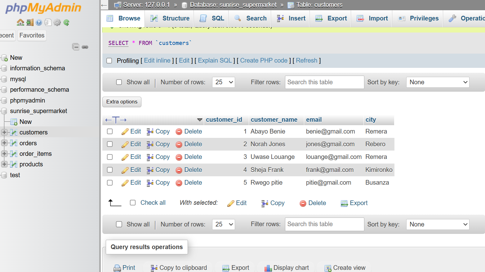
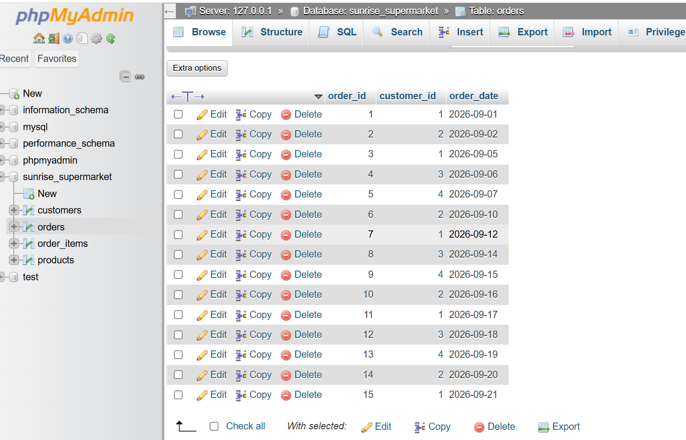
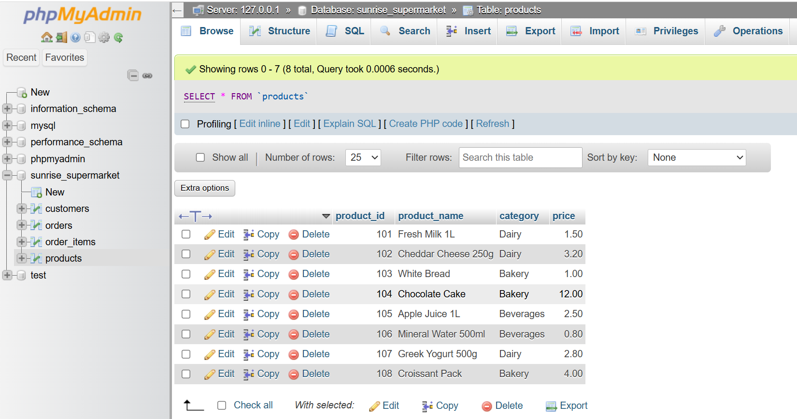
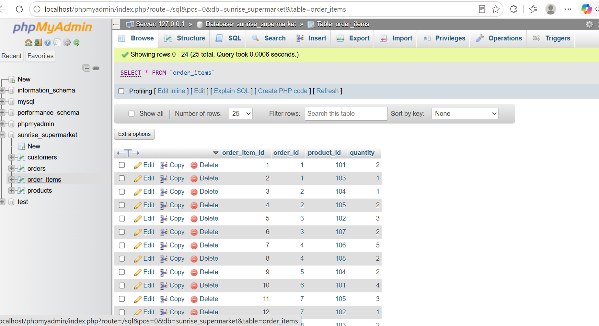

# Sunrise Supermarket Database Management System

**Course:** Database Management Systems (INSY 8311)  
**Student Name:** Bwiza Janviere  
**Student ID:** 20251SEN243  

---

## Project Overview
This repository contains the database schema, data insertion scripts, base table records, and analytical SQL queries for the **Sunrise Supermarket** management system built using MySQL/MariaDB and phpMyAdmin. The database models customer purchases, order items, product inventories, and sales analytics.

---

## Base Database Tables (Sample Data)

The `sunrise_supermarket` database models retail operations using four relational base tables.

### 1. `customers` Table
Stores customer profile records, including contact email and home city locations.
* **Fields:** `customer_id` (PK), `customer_name`, `email`, `city`



---

### 2. `orders` Table
Stores primary order headers linking sales transactions to specific customers and purchase timestamps.
* **Fields:** `order_id` (PK), `customer_id` (FK), `order_date`



---

### 3. `products` Table
Contains retail product details, pricing, and department classifications across Dairy, Bakery, and Beverages.
* **Fields:** `product_id` (PK), `product_name`, `category`, `price`



---

### 4. `order_items` Table
Junction table linking specific items and purchased quantities to corresponding order IDs.
* **Fields:** `order_item_id` (PK), `order_id` (FK), `product_id` (FK), `quantity`



---

## SQL Queries & Solutions

### Query 1: INNER JOIN (Orders & Customers)
Retrieves all customer orders along with customer names and cities.

```sql
SELECT o.order_id, c.customer_name, c.city, o.order_date 
FROM orders o 
INNER JOIN customers c ON o.customer_id = c.customer_id;

### Query 2: Multi-Table JOIN (Order Details & Product Info)
Joins order_items with products to display itemized order lines with product pricing and categories

SQL
SELECT oi.order_item_id, oi.order_id, p.product_name, p.category, p.price, oi.quantity 
FROM order_items oi 
INNER JOIN products p ON oi.product_id = p.product_id;

### Query 3: LEFT JOIN (All Customers & Their Orders)
Lists all registered customers including those who have not placed any orders (e.g., Rwego pitie)

SQL
SELECT c.customer_id, c.customer_name, o.order_id, o.order_date 
FROM customers c 
LEFT JOIN orders o ON c.customer_id = o.customer_id;

### Query 4: Aggregate Function with CTE (High-Value Customers)
Calculates total customer expenditure and filters for customers spending above the overall average spending 

SQL
WITH CustomerSpend AS (
    SELECT c.customer_id, c.customer_name, SUM(oi.quantity * p.price) AS total_spent 
    FROM customers c 
    JOIN orders o ON c.customer_id = o.customer_id 
    JOIN order_items oi ON o.order_id = oi.order_id 
    JOIN products p ON oi.product_id = p.product_id 
    GROUP BY c.customer_id, c.customer_name
) 
SELECT customer_id, customer_name, total_spent 
FROM CustomerSpend 
WHERE total_spent > (SELECT AVG(total_spent) FROM CustomerSpend);

### Query 5: Window Function — DENSE_RANK()
Ranks customer revenue generation across the entire client base using DENSE_RANK()

SQL
WITH CustomerTotals AS (
    SELECT c.customer_id, c.customer_name, COALESCE(SUM(oi.quantity * p.price), 0) AS total_spent 
    FROM customers c 
    LEFT JOIN orders o ON c.customer_id = o.customer_id 
    LEFT JOIN order_items oi ON c.customer_id = o.customer_id 
    LEFT JOIN products p ON oi.product_id = p.product_id 
    GROUP BY c.customer_id, c.customer_name
) 
SELECT customer_id, customer_name, total_spent, DENSE_RANK() OVER (ORDER BY total_spent DESC) AS spend_rank 
FROM CustomerTotals;

### Query 6: Window Function — ROW_NUMBER()
Generates chronological transaction order numbers per customer using ROW_NUMBER() partitioned by customer_id

SQL
SELECT c.customer_name, o.order_id, o.order_date, 
       ROW_NUMBER() OVER (PARTITION BY o.customer_id ORDER BY o.order_date ASC) AS order_sequence 
FROM orders o 
JOIN customers c ON o.customer_id = c.customer_id;


### Query 7: Cumulative Revenue Calculation
Computes individual order values and cumulative running sales total across time using windowed summation

SQL
WITH DailyOrderRevenue AS (
    SELECT o.order_id, o.order_date, SUM(oi.quantity * p.price) AS order_revenue 
    FROM orders o 
    JOIN order_items oi ON o.order_id = oi.order_id 
    JOIN products p ON oi.product_id = p.product_id 
    GROUP BY o.order_id, o.order_date
) 
SELECT order_id, order_date, order_revenue, 
       SUM(order_revenue) OVER (ORDER BY order_date ASC, order_id ASC) AS running_total_revenue 
FROM DailyOrderRevenue;

### Query 8: Window Function — LAG() & Days Between Orders
Tracks customer purchase frequency by calculating previous order dates and time elapsed between transactions using LAG() and DATEDIFF()

SQL
WITH OrderedCustomerOrders AS (
    SELECT c.customer_id, c.customer_name, o.order_id, o.order_date, 
           LAG(o.order_date) OVER (PARTITION BY o.customer_id ORDER BY o.order_date ASC) AS previous_order_date 
    FROM orders o 
    JOIN customers c ON o.customer_id = c.customer_id
) 
SELECT customer_id, customer_name, order_id, order_date, previous_order_date, 
       DATEDIFF(order_date, previous_order_date) AS days_since_last_order 
FROM OrderedCustomerOrders 
WHERE previous_order_date IS NOT NULL;

Business Interpretation: 
Our data shows two clear shopping patterns at Sunrise Supermarket:
Frequent Shoppers: Customers like Abayo Benie and Norah Jones return every 4 to 5 days for quick, regular grocery refills.

Weekly Shoppers: Customers like Sheja Frank shop every 8 to 9 days for larger, planned stock-ups.

How management can use this:
Tracking these habits allows us to set up automated alerts. For example, if a 5-day shopper like Abayo has not visited in 8 days, the system can flag her as overdue and automatically send a coupon or reminder before she switches to a competitor.


Challenges & Resolutions
Handling Inactive Customers:

Issue: Standard joins hid users like Rwego pitie who havenot placed an order yet.

Fix: Used a LEFT JOIN with COALESCE(..., 0) so zero-spend customers still show up in reports at $0.00.

Calculating Days Between Orders:

Issue: Calculating purchase gaps mixed up dates between different customers.

Fix: Applied PARTITION BY customer_id so each customers order gap is measured strictly against their own purchase history.

